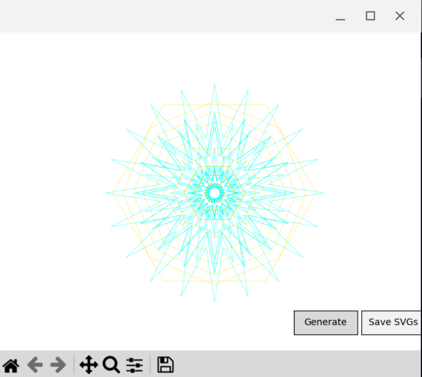

# Mandala Maker

This Python script, termed as "Mandala Maker," is designed to create and export Arab-inspired geometric patterns. These patterns are intricate and based on Islamic geometric design principles, suitable for various artistic and design applications, including laser cutting.

## Features

- Randomized generation of complex geometric patterns.
- Export functionality for patterns as SVG files.
- Adjustable parameters for pattern complexity and aesthetics.

## Screenshot

## Usage

Run the script to generate an initial pattern. Interact with the 'Generate' button to create new patterns, and use the 'Save SVGs' button to export the generated patterns into SVG format for each layer.

## Requirements

- Python 3.x
- Matplotlib
- Numpy

## Running the Script
To execute the script and start the Mandala Maker:

python mandala_maker.py

## ToDo
- Integrate color palette customization within the user interface.
- Enhance the algorithm for more advanced pattern interlacing.
- Scale up the generation for a larger number of layers while maintaining pattern clarity.
-  Develop a graphical user interface for ease of use by those not familiar with command-line operations.
## License
This project is released under the MIT License.
